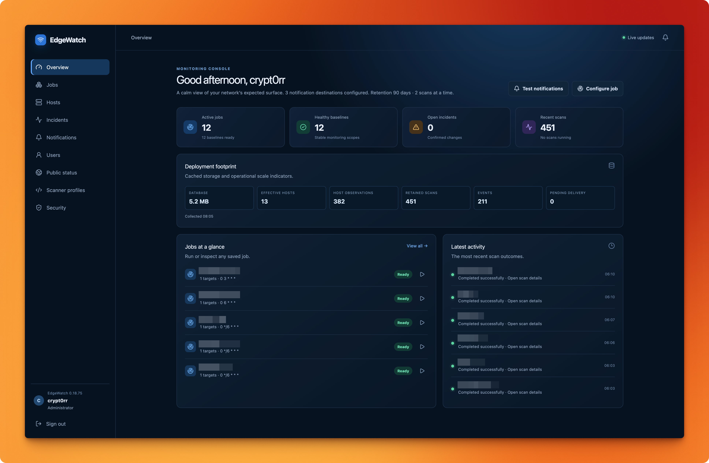

# EdgeWatch

[](https://github.com/crypt0rr/EdgeWatch/actions/workflows/ci.yml)
[](https://github.com/crypt0rr/EdgeWatch/actions/workflows/github-code-scanning/codeql)
[](https://github.com/crypt0rr/EdgeWatch/releases)
[](https://github.com/crypt0rr/EdgeWatch/pkgs/container/edgewatch)
[](go.mod)
[](LICENSE)

EdgeWatch is a self-hosted network-surface monitor. It schedules TCP and UDP
scans, learns what is expected, and notifies you when the observed surface
changes. It ships as one Docker image with an embedded web console and SQLite
storage.



> Only scan systems you own or are authorized to assess. Full-range UDP scans
> can take many hours and generate significant traffic.

## What you get

| Capability | What it does |
| --- | --- |
| Scheduled jobs | Monitor individual IPs, CIDRs, and DNS names on cron schedules. |
| TCP and UDP coverage | Use Nmap for both protocols, or Naabu full-range TCP discovery followed by Nmap confirmation. |
| Baselines and incidents | Establish an expected surface and receive alerts for confirmed port, service, or DNS changes. |
| Host evidence | Inspect effective IPs, positive ports, services, scan provenance, Nmap reasons, and summarized non-open results. |
| Notifications | Deliver Shoutrrr alerts to deployment-managed or encrypted web-managed destinations. |
| Safe administration | Use administrator, operator, and viewer roles, optional TOTP, and an optional limited public-status page. |
| Resumable broad scans | Continue large scans after timeouts or restarts without changing the monitored scope. |
| Update monitoring | See and optionally notify on new stable EdgeWatch releases. |

## Quick start

Requirements: Docker Engine and Docker Compose v2 on a host where Docker host
networking and the required scanner capabilities are available.

From a checkout of this repository:

```console
cp config.example.yaml config.yaml
# Keep the bind-mounted runtime state private without making it world-writable.
install -d -m 0750 ./data
docker compose pull
docker compose up -d
```

The container uses host networking so scanners can reach the same networks as
the Docker host. Runtime state, the SQLite database, and generated encryption
keys are stored in ./data.

The published image runs as UID 0 in a rootful Docker installation, so a
`0750` data directory is sufficient and avoids weakening host permissions. With
rootless Docker, container UID 0 maps to the invoking host user; if you prepare
the directory as another account, change its owner to the rootless Docker user
instead of using `chmod 777`. The same ownership rule applies to mounted secret
files. Keep notification and authentication key files owner-readable only:

```console
install -m 0600 notification-urls.example.txt ./notification-urls.txt
```

After enabling the corresponding secret mount in `compose.yaml`, you can check
the permissions before starting the daemon:

```console
docker compose run --rm --no-deps --entrypoint /bin/sh edgewatch \
  -c 'test -r /etc/edgewatch/config.yaml && test -w /var/lib/edgewatch && echo "runtime paths ready"'
```

If this check reports `Permission denied`, fix the host ownership for the
rootful or rootless mode you selected. Do not make the database or secret files
world-readable to work around the error.

If you are upgrading from a deployment that used the old named
edgewatch-data volume, the bind mount starts with fresh state. That volume is
left untouched and is not read or migrated automatically; restore or copy its
data only through a deliberate, stopped-database recovery procedure.

Open http://127.0.0.1:8080. On the first start, EdgeWatch prints a one-time
setup token to the container log:

```console
docker compose logs edgewatch | grep setup_token
```

The token expires after 15 minutes and creates the first admin account. The web
listener is loopback-only. For a remote Docker host, create an SSH tunnel from
your workstation:

```console
ssh -L 8080:127.0.0.1:8080 user@docker-host
```

Then open http://127.0.0.1:8080 locally. If the initial token was lost before
setup completed, a host operator can issue one replacement token:

```console
docker compose exec edgewatch edgewatch admin setup-token \
  --config /etc/edgewatch/config.yaml --force
```

This recovery action is refused after an administrator has been created.

### Tailscale Serve and reverse proxies

Keep EdgeWatch bound to loopback when exposing it through Tailscale Serve or a
reverse proxy. Serve the public hostname over HTTPS and add the hostname that
users open to `web.allowed_hosts`:

```yaml
web:
  listen: 127.0.0.1:8080
  allowed_hosts:
    - edgewatch.example.ts.net
```

Replace `edgewatch.example.ts.net` with your tailnet or proxy hostname. Use the
bare hostname only; do not include `https://`, a path, or a port. EdgeWatch
checks the forwarded `Host` value before authentication, so an unlisted proxy
hostname is rejected with `421 Misdirected Request` even when the loopback
listener is healthy. Approved non-loopback hostnames receive Secure session
cookies; direct loopback HTTP remains available for local administration and
SSH tunnels.

After changing the bind-mounted configuration, recreate the container:

```console
docker compose up -d --force-recreate edgewatch
```

You can verify both paths from the Docker host (replace the example hostname
with the one configured above):

```console
curl -i http://127.0.0.1:8080/api/v1/setup/status
curl -i -H 'Host: edgewatch.example.ts.net:8443' \
  http://127.0.0.1:8080/api/v1/setup/status
```

Both requests should return a successful response. If the direct request works
but the request with the proxy `Host` returns `421`, correct
`web.allowed_hosts`. The listener remains loopback-only; this setting approves
the public name, not a new network bind address.

## The first five minutes

1. Create the administrator with the setup token.
2. Open **Notifications** and add Shoutrrr destinations, or confirm the
   deployment-managed destinations from config.yaml.
3. Open **Scanner profiles** and keep the built-in profile or create an
   administrator-managed profile.
4. Create a job with its targets, TCP/UDP options, schedule, and baseline
   sample count.
5. Run the job, approve a successful scan as the baseline, and use **Hosts**
   and **Incidents** to inspect what changes over time.

Only completed, valid scans can establish or advance a baseline. Failed,
cancelled, timed-out, or incomplete scans remain visible for troubleshooting
but never turn a missing port into an expected state.

## Deploy and update safely

The supplied compose.yaml pulls ghcr.io/crypt0rr/edgewatch:latest; it does not
build locally. Pull explicitly whenever you choose to update:

```console
docker compose pull
docker compose up -d
```

The image uses a read-only root filesystem, drops all capabilities, and adds
NET_RAW for the default scanner modes. Host networking is intentional, and the
administration listener accepts only loopback addresses. Keep the service on
the Docker host or reach it through an authenticated SSH tunnel.

Naabu SYN discovery additionally needs NET_ADMIN. The normal Compose setup uses
connect discovery and does not grant that capability. If you have reviewed the
extra privilege and need SYN discovery, use the explicit override:

```console
docker compose -f compose.yaml -f compose.syn.yaml pull
docker compose -f compose.yaml -f compose.syn.yaml up -d
```

Adding the override does not change existing jobs or profiles to SYN. See
[docs/container-hardening.md](docs/container-hardening.md) for the capability
matrix and hardening rationale.

## Configuration at a glance

config.yaml contains deployment settings. Create monitoring jobs and manage
users, destinations, scanner profiles, baselines, and public status in the web
console. See [config.example.yaml](config.example.yaml) for the complete
validated schema.

| Configuration | Managed in | Purpose |
| --- | --- | --- |
| database, retention | YAML | SQLite location and history retention. |
| web.listen, web.allowed_hosts, web.trusted_proxies | YAML | Loopback listener, approved tunnel/proxy host names, and explicitly trusted proxy networks. |
| scheduler.* | YAML | Concurrent scans and probe budgets. |
| scanner.target_exclusions | YAML | Addresses that may never be scanned. |
| enrichment.rdap.enabled | YAML | Enable or disable on-demand public network-registration lookups. |
| updates.enabled | YAML | Enable or disable the three-hour stable-release check. |
| notifications.urls, urls_file | YAML/secrets | Deployment-managed Shoutrrr destinations. |
| Jobs, users, profiles, web destinations | Web console | Runtime administration stored in SQLite. |

The YAML jobs section from older deployments is not imported into the scheduler.
Such jobs remain inactive and EdgeWatch shows a startup warning so they can be
recreated and reviewed explicitly in the console.

Important defaults:

- The web listener defaults to 127.0.0.1:8080; non-loopback listeners are
  rejected.
- Requests using a proxy or tunnel host must match `web.allowed_hosts`; foreign
  Host headers are rejected before authentication. Keep this list limited to
  names you control.
- Forwarding headers are ignored unless the connecting proxy addresses are
  explicitly listed in web.trusted_proxies.
- Loopback, link-local, and cloud metadata addresses are excluded by default.
  Change scanner.target_exclusions only when you understand the host-network
  exposure.
- RDAP is enabled by default and is requested only when an authenticated user
  opens a public host. Private and special-use addresses are never queried.
  Set enrichment.rdap.enabled: false for isolated or privacy-sensitive
  deployments.
- Update checks are enabled by default, run at startup and every three hours,
  and consider stable GitHub releases only. Set updates.enabled: false for
  offline deployments. Checks reveal the host's public IP and EdgeWatch user
  agent to GitHub; EdgeWatch reports updates but never upgrades itself.

## Scanning

### Nmap or Naabu to Nmap

Each TCP job chooses a scanner engine:

| Engine | Behavior |
| --- | --- |
| **Naabu discovery to Nmap** | Naabu discovers TCP ports 1-65535, then Nmap confirms discovered ports and can identify services. Only Nmap-confirmed positive states affect baselines and incidents. |
| **Nmap only** | Nmap scans the configured TCP port expression directly. |

Naabu connect discovery is the built-in default for new TCP jobs. SYN profiles
are available only when the runtime has both NET_RAW and NET_ADMIN. UDP is
always Nmap-only. Naabu evidence and disagreements are retained as diagnostic
data, but they do not independently create incidents.

Jobs can configure TCP and UDP independently, service detection, timing,
timeouts, host discovery (assume_alive), and approved scanner-profile
overrides. EdgeWatch executes fixed Nmap and Naabu binaries with validated
argument arrays; it never runs browser-supplied shell commands or arbitrary
executables.

Full-range scans are deliberately bounded by scheduler probe budgets. A broad
scan may be split into resumable address, discovery, enrichment, and UDP work
units. A timeout or restart preserves completed work for the configured resume
window; partial work cannot change a baseline. The dashboard shows scanner
phase, heartbeat, completed probes, ports found, and the last sanitized output.

## Jobs, baselines, and incidents

Jobs accept individual IP addresses, CIDRs, and DNS names. DNS names remain
logical targets while each resolved effective address is shown separately in
host evidence. Schedules use five-field cron syntax in the selected IANA
timezone. New jobs receive an optional 30-minute schedule-offset suggestion
when another active job is nearby; the administrator can keep concurrent times.

Choose how many successful samples establish a baseline and how many matching
changes confirm an incident. When a security-impacting job setting changes,
EdgeWatch shows the affected scope and asks for explicit rebaselining. Schedule
and execution-tuning changes do not reset the baseline.

From **Incidents**, an administrator can:

- **Accept change** to make the current observation expected while preserving
  the original scan history.
- **Suppress 1 scan** to defer the alert for the next successful scan. If the
  change remains, it is reported again afterward.

The **Hosts** page aggregates the latest successful result for each effective
IP. A host detail page shows configured-target relationships, TCP/UDP coverage,
positive ports, services, scanner provenance, and summarized closed/filtered
results. Opening a public host may load normalized RDAP information from the
authoritative registry; raw responses and contact records are not retained.

## Notifications

EdgeWatch uses [Shoutrrr](https://github.com/containrrr/shoutrrr) for delivery.
Destinations can be supplied in config.yaml or a protected URL file, or added as
named web-managed destinations. Web-managed URLs are write-only and encrypted
at rest; their credentials are never returned by the API or written to logs.

Each job can select its own destinations. On the **Notifications** page,
**Update alerts** is an independent toggle on each configured destination:

- pausing a destination does not erase its update-alert selection;
- deployment-managed destinations remain read-only for credentials but their
  update-alert routing can still be changed;
- saving an empty selection keeps update alerts silent while checks and the
  in-console indicator continue to work;
- password confirmation is required for every routing or credential change.

Scan changes, scan failures, cancellations, timeouts, stalled cycles, and
recovery events can all generate notifications. Delivery is retried durably;
terminal failures are visible in the console without exposing provider errors
or destination secrets.

## Users and public status

The first account is an administrator. Administrators can invite additional
accounts with single-use activation links. Every user can manage their own
display name, password, and optional TOTP protection.

| Role | Access |
| --- | --- |
| Administrator | Full administration, users, destinations, profiles, jobs, baselines, incidents, and public status. |
| Operator | Configure and run jobs, review evidence and incidents, and select existing destinations for jobs; cannot manage destinations or users. |
| Viewer | Read-only jobs and baseline information. |

An administrator can enable **Public status** and explicitly publish selected
effective hosts. The unauthenticated /public page contains only the chosen job
names, latest successful scan time, positive ports, service names, and cached
normalized network-registration data. It does not expose raw Nmap evidence,
product fingerprints, credentials, or an arbitrary RDAP proxy.

## Data, backup, and recovery

All runtime state lives in ./data, including:

- edgewatch.db and SQLite sidecars;
- notification.key for web-managed Shoutrrr URLs;
- auth.key for TOTP encryption when the default key location is used;
- optional backups and exported baselines.

Back up the complete ./data directory together with config.yaml and any
separately mounted secret files. For a live, consistent database snapshot:

```console
mkdir -p ./data/backups
docker compose exec edgewatch edgewatch backup \
  --config /etc/edgewatch/config.yaml \
  --out /var/lib/edgewatch/backups/edgewatch-backup.db \
  --output json
docker compose exec edgewatch edgewatch verify \
  --config /etc/edgewatch/config.yaml --output json
```

The backup command uses SQLite's online snapshot support. A raw directory copy
must be made while EdgeWatch is stopped so the database and WAL sidecars stay
consistent. Never replace a live database. Restore with the host-safe command,
verify it, and only then start the service again:

```console
docker compose stop edgewatch
docker compose run --rm --no-deps -T edgewatch edgewatch restore \
  --config /etc/edgewatch/config.yaml \
  --from /var/lib/edgewatch/backups/edgewatch-backup.db \
  --output json
docker compose run --rm --no-deps -T edgewatch edgewatch verify \
  --config /etc/edgewatch/config.yaml --output json
docker compose up -d edgewatch
```

The current schema is version 44. Database migrations are forward-only. An
older image must not be pointed at a database already upgraded by a newer
image; restore the matching pre-upgrade ./data backup if a rollback is
required. Keep encryption keys with the database or encrypted web-managed
destinations and never commit them.

## Useful commands

Run these from the host with docker compose exec:

```console
# Validate deployment configuration
docker compose exec edgewatch edgewatch config validate \
  --config /etc/edgewatch/config.yaml

# Check migrations, leases, and runtime health
docker compose exec edgewatch edgewatch health \
  --config /etc/edgewatch/config.yaml --output json

# Inspect jobs and their latest scan state
docker compose exec edgewatch edgewatch status \
  --config /etc/edgewatch/config.yaml --output json

# Run or inspect a managed job from the CLI
docker compose exec edgewatch edgewatch scan \
  --config /etc/edgewatch/config.yaml --job JOB_NAME
docker compose exec edgewatch edgewatch history \
  --config /etc/edgewatch/config.yaml --job JOB_NAME --limit 20

# Test configured notification delivery
docker compose exec edgewatch edgewatch notify test \
  --config /etc/edgewatch/config.yaml
```

For a scan that appears stuck, open its live details in the dashboard first.
Broad jobs report scanner phase, process heartbeat, completed probes, and
resumable work. If a cycle has timed out, it will resume on the next scheduled
or manual run until its resume window expires. Check docker compose logs
edgewatch for a bounded error summary; do not assume a zero-progress display
means the process is idle.

## Development

The project uses Go 1.27.1 or newer and Node.js 24.21.0. From the repository
root:

```console
npm ci
make check
npm run build
npm run test:coverage
npm run test:e2e
docker compose config --quiet
```

The production image embeds the frontend and does not include Node.js. Use
controlled listeners for integration scans and never commit notification URLs,
passwords, setup tokens, database files, or encryption keys.

More security detail is in [SECURITY.md](SECURITY.md); container capability
guidance is in [docs/container-hardening.md](docs/container-hardening.md).

## License

EdgeWatch is released under the [MIT License](LICENSE). Licenses for bundled
third-party components are listed in
[THIRD_PARTY_LICENSES.md](THIRD_PARTY_LICENSES.md).
